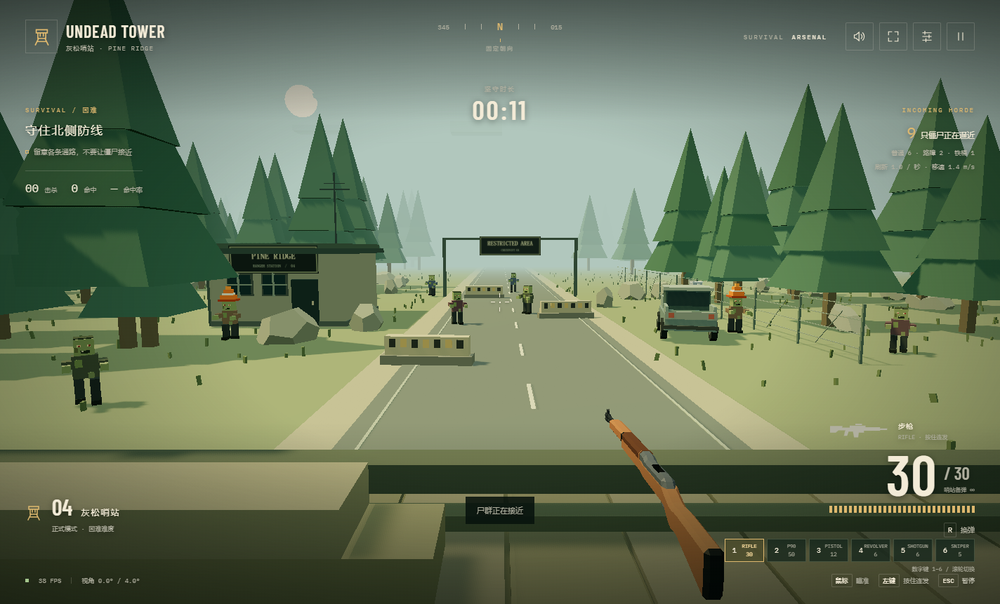
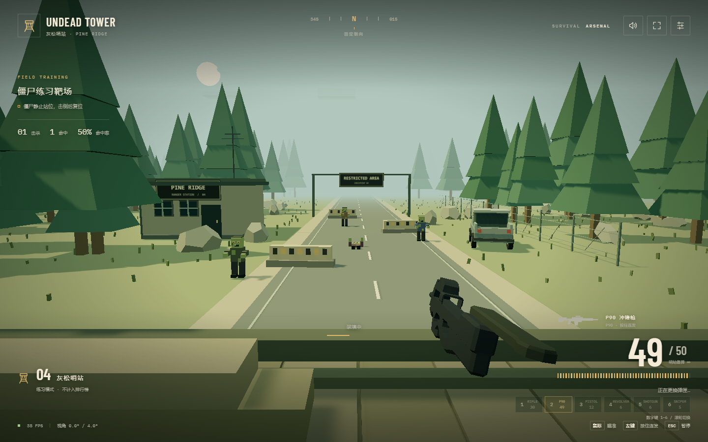

# Undead Tower

一款低多边形风格的第一人称僵尸生存射击游戏。守在灰松哨站的哨塔上，切换枪械，击退从公路与树林不断逼近的僵尸，挑战自己的最长坚守纪录。

你的位置固定，无法走动或转身。鼠标控制瞄准方向，镜头只会小幅跟随；留意整个前方视野，优先处理离哨塔最近的敌人。



## 怎么玩

- **练习模式**：僵尸是不会移动的靶子，击倒后会重新出现。可以放心熟悉瞄准、切枪和换弹，不会失败，也不记录成绩。
- **正式模式**：僵尸会绕过障碍向哨塔逼近。移速固定为 **1.4 米/秒**，但出现得越来越密集；任何一只僵尸靠近哨塔，就会结束本局。先播放突破者特写，再显示坚守时长和排行榜。
- **留意护甲**：普通僵尸最容易击倒，路障和铁桶僵尸更耐打。护具被打落后会变成普通僵尸，爆头能造成更高伤害。

正式模式没有固定通关时间，目标是尽量守得更久。排行榜记录当前浏览器中的前 10 名成绩，刷新个人最佳时会给出提示。更换浏览器或清除网站数据后，原来的纪录不会自动跟随。

## 操作

开局即可使用六款枪械：**1 步枪、2 P90 冲锋枪、3 半自动手枪、4 左轮手枪、5 泵动霰弹枪、6 栓动狙击枪**。

步枪和 P90 可以按住左键连发，其余枪械每次点击射击一次。每把枪单独保留弹匣里的子弹，切枪不会补弹；备弹无限，但仍需要换弹。霰弹枪逐发装填，切枪会等待当前动作结束。

| 操作 | 功能 |
| --- | --- |
| 移动鼠标 | 瞄准 |
| 鼠标左键 | 开火 |
| R | 换弹 |
| 数字键 1–6 / 鼠标滚轮 | 切换枪械，也可点击右下角武器栏 |
| Esc | 暂停 / 继续 |
| M | 静音 / 恢复声音 |
| 右上角设置 | 调整音量、开关粗颗粒像素效果 |
| 右上角全屏按钮 | 进入 / 退出全屏 |

切到其他窗口时游戏会自动暂停。建议使用电脑、鼠标和键盘游玩。



## 在本地开始游戏

1. 安装 [Node.js](https://nodejs.org/) **22.12 或更高版本**，安装时保留 npm。
2. 在本仓库页面点击 **Code → Download ZIP**，解压后进入包含 `package.json` 的文件夹。
3. 在这个文件夹中打开终端，依次运行：

```sh
npm ci
npm run dev
```

第一次安装依赖需要联网。终端显示启动成功后，在 Chrome 或 Edge 中打开 [http://127.0.0.1:5175/](http://127.0.0.1:5175/)，选择模式即可开始。

之后再玩，只需在同一文件夹运行 `npm run dev`。Windows 用户也可以双击 **start-game.cmd**，它会在需要时安装依赖并自动打开浏览器。

游玩期间保持终端窗口打开；结束后在终端按 `Ctrl+C` 即可停止。若终端显示了不同端口，请以终端中的本地地址为准。画面无法加载时，请确认浏览器已开启硬件加速。

## 鸣谢

枪械模型来自 [Quaternius Animated Guns Pack](https://quaternius.com/packs/animatedguns.html)，采用 CC0 许可。
