# Undead Tower 验收记录

## 快速换弹、持枪视野与手部动作（2026-09-04，仅源码/网页版）

- 换弹由 1.55 秒减为 0.775 秒；空仓和战术换弹一致，装填完成前不补弹、不允许开火，重复按 R 不重置进度。
- 持枪缩放由 0.70 改为 0.52，位置下移并前推，窄窗口自适应横向位置。新视角通过真实头部命中、枪口弹道共线和有限镜头范围回归。
- 独立弹匣及其表面部件随左手移动；旧匣抽出并脱手下落，新匣插入、压紧。空仓才执行释放枪机，右手维持握持；左肩固定，双段手臂根据腕部位置求解。抽匣、插匣与空仓枪机动作有同步机械声。
- 动画、机械声与进度条取实际换弹进度，无独立 CSS 计时；暂停时动作、弹药与进度条同步冻结，恢复继续，结束复位。动画期间不创建新模型。
- `npm run verify` 通过：56 项单元测试、网页构建、15 项浏览器测试（单 worker）。新增 0.774 秒前禁射、0.775 秒完成、空仓/非空仓区分、姿态复位；浏览器捕获退匣/插匣/枪机阶段，验证暂停冻结、恢复补弹与射击。手臂比例最终微调另行复验换弹用例并查看截图。
- 截图通过真实操作到达相应阶段并暂停，仅为展示模型而隐藏测试页面的暂停遮罩。历史 720 局平衡数据使用 1.55 秒换弹，已加注说明，本轮没有重复模拟。
- EXE 保持不变，SHA-256 为 `3421037cfde0b10fcd74329891d16430ffd70e05b096164c543cb042427479a1`。

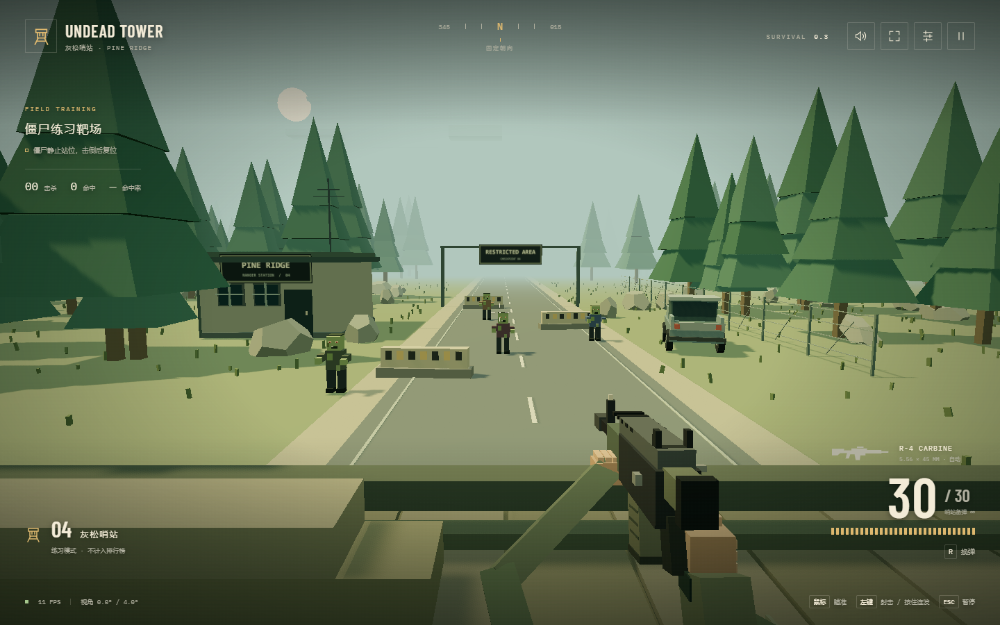

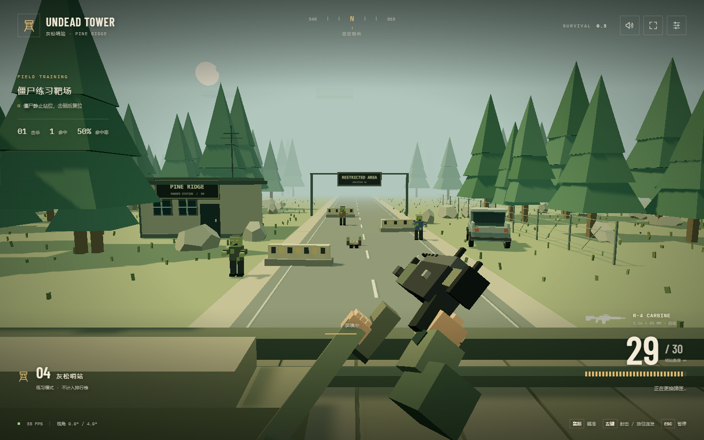

## 护具音色、死亡低吼与背景音乐（2026-09-04，仅源码/网页版）

- 强化原有路障/铁桶受击与脱落声：路障短促塑料撞击、铁桶非整数泛音金属余响，起音延后 35 毫秒，减少被枪声瞬态掩盖。
- 确认击杀时触发约 0.62～0.73 秒合成低吼，三种细微变化，最多重叠三声，旧声由新声替换并回收音频节点；击落护甲不触发死亡叫声。
- 新增原创 9.6 秒循环旋律与低音和弦，缓存 PCM、单实例循环；独立音乐增益为 0.028，音效触发时降至 0.007 并平滑恢复。暂停、设置、失焦/后台、失败与菜单停止，继续接续，新局重置；静音和零音量同样停止循环。
- `npm run verify` 通过：53 项单元测试、网页构建、14 项浏览器测试（单 worker）。新增验证音乐不叠加、压低/启停、死亡声音上限、PCM 样本有限且不削波、循环边界接近零、BGM 混音后的 RMS 低于死亡音效的三分之一；实际对局验证护具提示、击杀低吼、音量持久化与音乐生命周期。
- 本轮未重新打包，EXE SHA-256 仍为 `3421037cfde0b10fcd74329891d16430ffd70e05b096164c543cb042427479a1`。

## 失败定位、护甲脱落与试玩反馈（2026-09-04，仅源码/网页版）

- 失败判定记录实际最先越线的 ID，同刻越线按 ID 稳定选择。失败时收起枪模，避免挡住右侧突破者；红框、着色和文字标出僵尸及突破方向。先定格约 2.4 秒再结算，可提前跳过或从结算返回查看；全程冻结战斗与计时。
- 正式模式显示金色 8 米圆弧及外侧刻度，接近变橙、失败变红；提示不参与枪口遮挡，并允许透过哨塔前景显示。
- 本体 100 血，路障额外 100 护甲，铁桶额外 300 护甲。所有命中优先扣护甲、溢出伤害扣本体，维持原 1/2/4 爆头与 2/4/8 身体枪数。护甲耗尽立刻变为普通僵尸并移除护具碰撞，脱落的原模型飞起、旋转、落地并在 2 秒内回收；最多 24 件共用实例绘制，暂停冻结，重开清空。
- 路障和铁桶有不同的受击与脱落合成音；所有声音经主音量节点输出。0～100% 音量与静音独立保存，取消静音恢复原音量，存储损坏或不可用仍可游玩。
- 个人纪录在写入本次成绩前按同难度比较，区分首次建立、刷新、追平和追赶，显示提升或差距；保持当前困难榜和存储键。
- 50 项单元测试通过，覆盖拆甲后本体存活、实际碰撞移除、脱落轨迹与回收、首个越线者及重置、纪录比较、音频主通路/静音/零音量/存储容错。网页构建通过，14 项浏览器测试通过（单 worker）；最后的失败红框和枪模遮挡调整另行复验正式对局。
- 已查看真实浏览器截图：护甲脱落、失败定格、个人纪录和桌面/375px 设置。截图中的 5 秒旧纪录由测试预置，仅用于验证刷新个人纪录提示，不是真人试玩数据。
- 便携测试脚本兼容旧难度选择和新固定困难界面；本轮仅检查脚本语法，未执行便携打包或成品测试。EXE 校验值保持 `3421037cfde0b10fcd74329891d16430ffd70e05b096164c543cb042427479a1`。

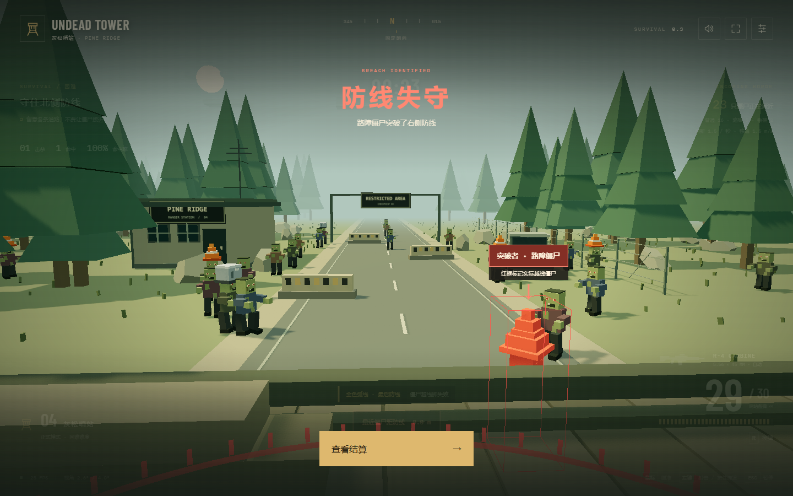

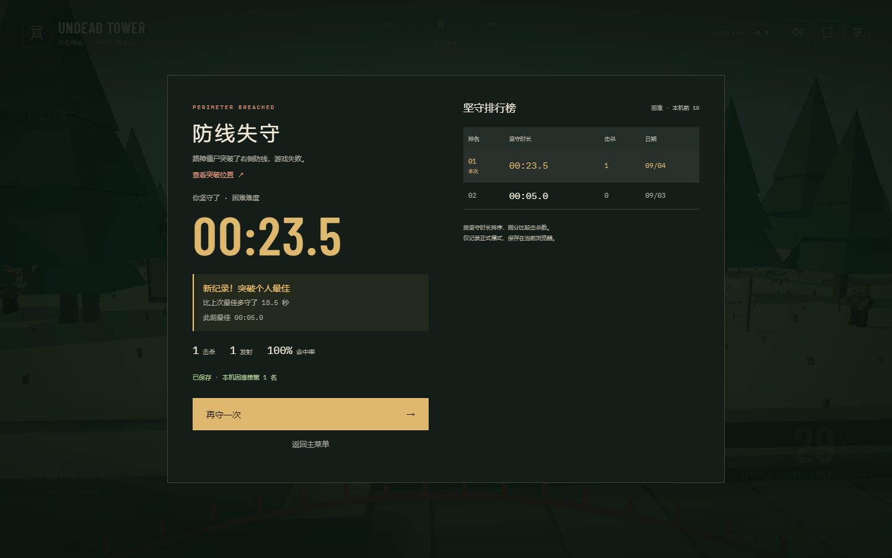

## 固定困难难度与最快镜头跟随（2026-09-04，仅源码/网页版）

- 移除简单、普通、困难选择，保留练习/正式模式；正式开局、暂停重开和失败重试统一使用困难规则。
- 排行榜只展示已有困难榜，存储键不变，旧简单和普通数据保留，不混入困难成绩。
- 移除镜头阻尼滑块及运行时调节接口，固定 λ=5（原最快跟随端），90% 跟随约 0.46 秒；水平 ±4°、垂直 ±2.5° 仍保持固定。
- `npm run verify` 通过：45 项单元测试、生产构建、13 项浏览器测试（单 worker）。覆盖护甲生成/爆头、有限视角、设置无滑块、固定困难与练习切换、重开、自然失败、排行榜持久化及窄屏布局。
- EXE 未重新打包，SHA-256 仍为 `3421037cfde0b10fcd74329891d16430ffd70e05b096164c543cb042427479a1`。以下为历次版本的历史验收记录。

## 圆弧突破与轻微避让（2026-09-04，仅源码/网页版）

- 僵尸出生时获得独立的 8 米圆弧突破点；同一入口的个体也会分散。圆弧范围考虑窗口宽度和有限视角，通过原有通路后向不同目标接近。近邻活僵尸以平滑、限速的横向转向错开，尸体不参与，临近目标时避让减弱。
- 45 项单元测试通过，新增 9 项覆盖圆弧半径与窄屏可见性、同入口目标差异、不同突破点到达、重叠队列分散、横向/总速度上限、更新顺序一致性、尸体排除、入场通路保持、高速过路径点与越线、不同帧率下不在终点徘徊。
- 生产构建通过，13 项浏览器测试通过（单 worker，约 1.6 分钟）。确认真实对局各僵尸目标不同且不随帧改变，通过路径点后继续前进，失败点在可见防区，护甲命中、暂停、结算、重开和本机排行榜正常。已查看实际对局截图。
- 首轮浏览器测试发现模拟工具与 Vite 开发服务共用缓存，导致依赖返回 `504 Outdated Optimize Dep`。模拟工具改用独立缓存后，与浏览器测试同时运行仍正常；720 局模拟复跑结果一致。
- 一般操作的 60 FPS 坚守中位数为简单 86.0、普通 75.3、困难 66.3 秒；比改动前增加 0.8～1.3 秒。熟练操作增加 1.7～2.3 秒。详见 [BALANCE.md](BALANCE.md)，这是操作模型估算，不是真人数据。
- 未重新打包 EXE；修改前后 SHA-256 均为 `3421037cfde0b10fcd74329891d16430ffd70e05b096164c543cb042427479a1`。已将“明确要求后才重新打包”的约定写入 AGENTS.md。

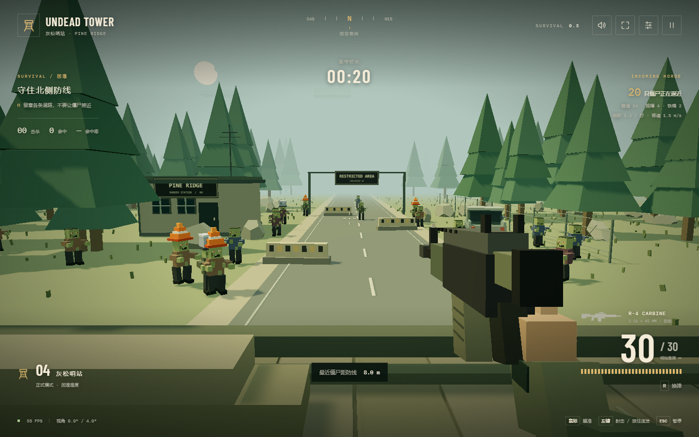

## Windows portable EXE（0.3.0）

- `npm run dist:portable` 成功生成 `release/Undead-Tower-0.3.0-portable-x64.exe`，103,201,923 字节，Windows x64 单文件免安装版；主程序名称、图标和版本资源已写入。当前未签名。
- `npm run test:portable` 直接启动成品副本，开启离线模拟并重新加载，生产 WebGL 场景正常；加载请求全部来自包内 `undead://game/`，没有访问网页开发服务器或远程资源。生产页面没有 Node API 和开发诊断入口。
- 真实输入验证练习开火消耗弹药、R 装填、Esc 暂停、UI 全屏；困难模式约 11 秒前出现铁桶，随后自然失败并保存成绩。已查看成品对局截图，持枪、场景、僵尸和 HUD 显示正常，页面异常为零。
- 正常退出后，将测试 EXE 与 `Undead Tower Data` 一起移动到另一中文目录，再次离线启动，困难排行榜中同一条成绩可读。两次启动均正常退出；测试数据不写入交付目录。
- 构建时校验 Electron 官方 npm 包附带的运行环境 SHA-256，包内包含前端、字体、Electron、Chromium 的许可说明。发布文件 SHA-256 为 `3421037cfde0b10fcd74329891d16430ffd70e05b096164c543cb042427479a1`，校验文件与 EXE 放在同一目录。
- 结果见 [成品验证数据](portable-validation.json)，操作与重建见 [PORTABLE.md](PORTABLE.md)。实际测试环境为本机 Windows 11 x64；其他电脑的性能和驱动兼容性尚未实机验证。

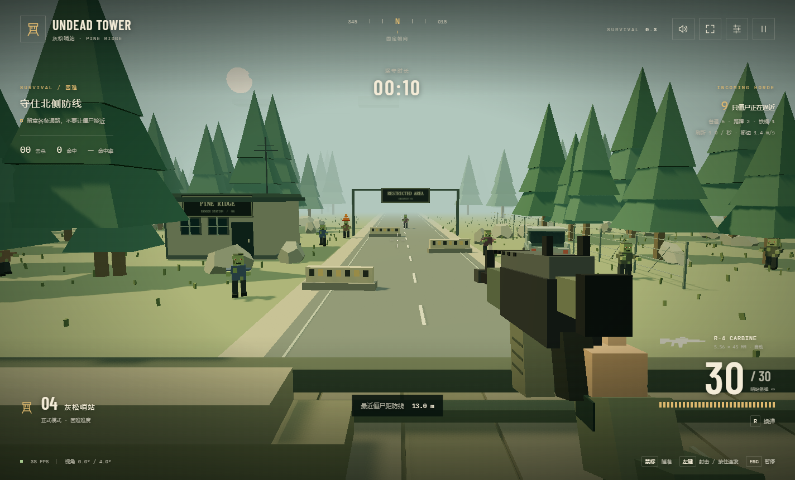

## 开局护甲比例调整（当前规则）

- 移除 30 秒门槛；普通从开局循环 3 普通、1 路障，困难循环 6 普通、2 路障、1 铁桶。三档的刷新、移速及增长曲线沿用统一参数。
- 36 项单元测试和生产构建通过。验证开局完整序列、首只路障在 6 秒前、首只铁桶在 11 秒前、重开清零，以及旧排行榜数据保留。
- 12 项原有浏览器回归通过；护甲用例首次因把“已出生”当作“已能命中”失败，修正测试后单独复验通过（17.1 秒）。合计 13 项通过，单 worker。护甲用例确认路障在 5～6 秒、铁桶在 11 秒前出生，实际命中头部分别 2 次、4 次击杀，没有修改游戏时钟、血量或遮挡逻辑。
- 720 局模型模拟完成。60 FPS 下一般操作坚守中位数为简单 84.7、普通 74.5、困难 65.4 秒；熟练操作为 142.1、122.1、104.6 秒。两档帧率的一般/熟练样本均在 60～180 秒，真人可能因遮挡和失误更早结束；详见 [BALANCE.md](BALANCE.md)。
- 当前榜使用 `undead-tower.leaderboard.armor-v3`，按难度独立记录，旧 `v1` 和 `armor-v2` 数据保留。

## 护甲难度与时长评估（0.3.0 初版，历史规则）

- 三档共享原普通难度的刷新和移速曲线；僵尸生命为普通 100、路障 200、铁桶 400，头部（含护具）伤害 100、身体伤害 50。
- 30 秒前仅普通僵尸。之后普通难度按 4 普通、1 路障循环；困难每 4 只路障追加 1 只铁桶。计数在重开时清零，练习仅生成普通僵尸。
- 35 项单元测试全部通过：统一曲线、刷新积分、各难度完整出怪序列、生命值、头部/身体/护具射线命中、隐藏护具不参与普通僵尸碰撞、练习复位等。
- `npm run verify` 通过：TypeScript 与生产构建成功，13 项真实浏览器测试通过（单 worker，约 2 分钟）。包含旧有瞄准、开火、换弹、溅血、暂停、有限视角、模式切换、排行榜和小屏界面回归。
- 新浏览器测试通过游戏鼠标/键盘事件守到约 41 秒，验证路障和铁桶实际生成；每次爆头检测真实剩余生命，确认路障 2 次、铁桶 4 次爆头击杀。测试没有注入僵尸、修改生命或加速游戏时钟；页面无异常。
- 已查看实际对局截图，路锥造型和三类敌人计数可见；护具射线命中也由单元测试覆盖。
- `npm run balance` 完成 720 局纯逻辑模拟（5 种操作假设、3 难度、30/60 FPS、每组 24 个种子）。方法、逐局数据、玩家假设和 1～3 分钟目标评估详见 [BALANCE.md](BALANCE.md)。模拟不是实测玩家数据或绝对极限证明。
- 新规则榜使用 `undead-tower.leaderboard.armor-v2`，旧版 `v1` 数据保留，不与当前成绩混排。

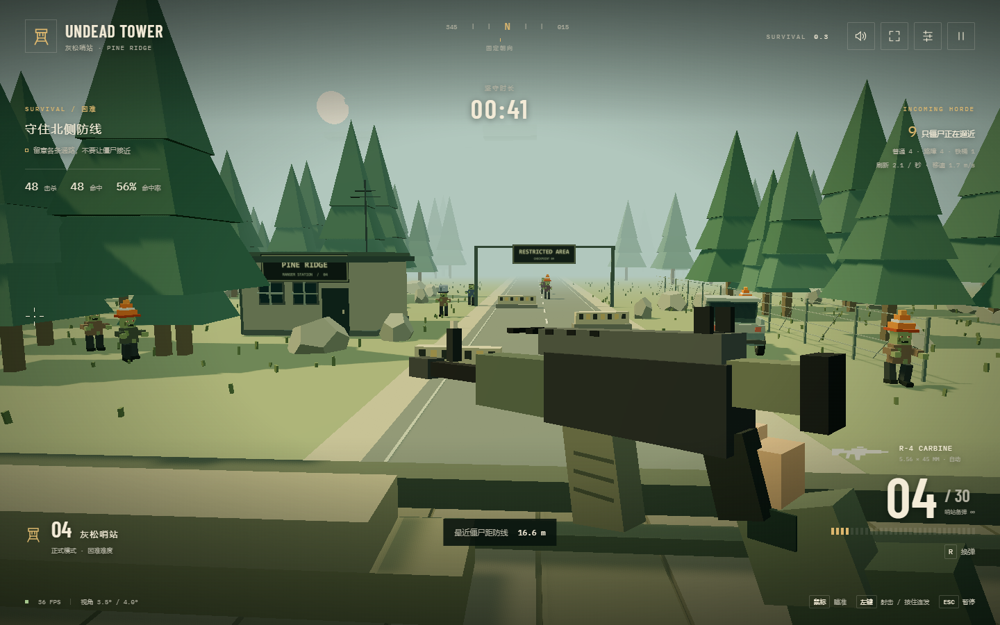

## 多方向刷新增量验收

- 正式模式从前方防区八处入口生成：远端公路、左右路肩、检查站通道、站前空地、围栏通路和左右林地。每轮随机排列后依次使用；八处入口共享总刷新频率，仍然最多每秒 10 只。
- 各固定区域在小范围内随机取点，使用各自接近路径。窄视野筛选不可见的固定入口，保留正面入口和适配窗口的两侧林地入口。
- 28 项逻辑测试通过，包括多个随机种子和镜头角度下每轮八个入口的完整覆盖，以及窄视野筛选；原有刷新曲线和上限测试通过。
- 3 项正式模式浏览器测试通过（单 worker，37.2 秒），验证真实对局首轮八个入口出怪、前进、击杀溅血、暂停、失败、排行与重开。生产构建通过。
- 已查看实际截图，公路正面、检查站附近和林地同时出现僵尸。

## 击杀溅血增量验收

- 致命命中产生红色方块喷溅；普通击杀 32 滴、爆头 44 滴，从实际枪口射线的命中点产生，约 1 秒内下落消散。
- 血滴独立合批绘制，池容量 384，满额覆盖最早粒子；不参与子弹遮挡检测。暂停时冻结，重新开始或返回菜单清空。
- 生产构建通过。复验 3 项真实浏览器流程：原有开火/装填、练习模式爆头/溅血位置/自动消散/靶子复位、正式模式移动击杀/溅血/结算/重开清理，全部通过（单 worker，42.2 秒）。
- 已查看实际击杀截图，确认红色方块喷溅在命中位置可见。

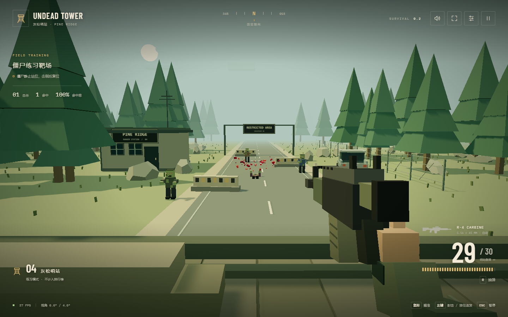

## M1 僵尸生存（0.2.0）

验收日期：2026-09-03。环境：Windows、本机 Chrome、Node.js 22.23.1。以下为当前版本结果，后文保留 M0 历史记录。

### 手动验收

1. 主菜单选择练习模式：僵尸不移动，头部一发、身体两发击倒，3 秒后复位；等待不会失败。
2. 选择正式模式，分别选择简单、普通和困难开始，HUD 应显示实际选择的难度。
3. 留意画面左右边缘，僵尸持续出现并向前方射击区和哨塔移动；移动鼠标后依然只能小幅转动镜头。
4. 射击移动中的僵尸，检查命中、爆头、倒地、击杀统计；正式僵尸不会原地复活。
5. 观察 HUD 中坚守时长、尸群数量、每秒刷新率、移速和距防线距离。时间越久，刷新与移速越高。
6. Esc 暂停或进入设置，等待后继续；暂停期间的时长、僵尸位置和刷新数不应变化。失焦和切换标签页同样自动暂停。
7. 停止射击，等待最近僵尸到达 8 米半径。应出现“防线失守”，展示精确到 0.1 秒的坚守时间与击杀、发射、命中率统计。
8. 结算后点击背景、按 R 或 Esc 不得继续射击、移动或恢复对局。“再守一次”保留难度、重置对局；“返回主菜单”可切换模式。
9. 重新加载页面，从主菜单查看排行榜，对应难度保留成绩；其他难度分别显示自己的榜单，练习成绩不入榜。

### 自动化结果

| 项目 | 结果 |
| --- | --- |
| 单元测试 | 4 个文件、26 项全部通过 |
| TypeScript 与生产构建 | 0.2.0 构建通过；保留 Three.js 单块超过 500 kB 的提示 |
| 浏览器测试 | 12 项通过，单 worker 串行；移动击杀断言加入后，3 项正式模式流程复验通过 |
| 正式模式闭环 | 实际鼠标击杀移动僵尸、自然失败、结算保存、同难度重试、返回菜单、刷新读取排行榜均通过 |
| 有限视角与射击回归 | 原有 9 项浏览器验收通过，包括枪管对准、开火特效、换弹与静止渲染 |
| 屏幕边缘出生 | 单测覆盖窄屏、桌面、宽屏和镜头左右极限，出生点投影保持在左右边界外侧 |
| 路线与失败距离 | 僵尸先收拢到前方，再向玩家前进，移动不能跨过 8 米失败半径；结算时长冻结 |
| 难度与刷新上限 | 三档增长曲线、20/60/144 FPS 下刷新数量一致性、封顶后每秒 10 只均通过 |
| 数量边界 | 包含待回收尸体在内，实例数量不超过 256 |
| 排行榜 | 分难度前 10、时长/击杀排序、重复结算去重、存储损坏、保存失败降级均通过 |
| 实际界面 | 已查看桌面模式选择、正式游玩、失败结算和 375px 模式选择截图；正式模式菜单和榜单可操作 |
| 页面异常 | 正式模式全流程监听 `pageerror`，无异常 |

刷新封顶的长期曲线通过模拟时间测试验证；本次没有运行数分钟的高密度 GPU 压测，不以测试通过承诺所有设备的帧率。尸群使用单个 `InstancedMesh`，保留 60 FPS 绘制上限、1080p 像素预算、10 Hz 阴影和暂停/后台停绘策略。

### M1 实际画面

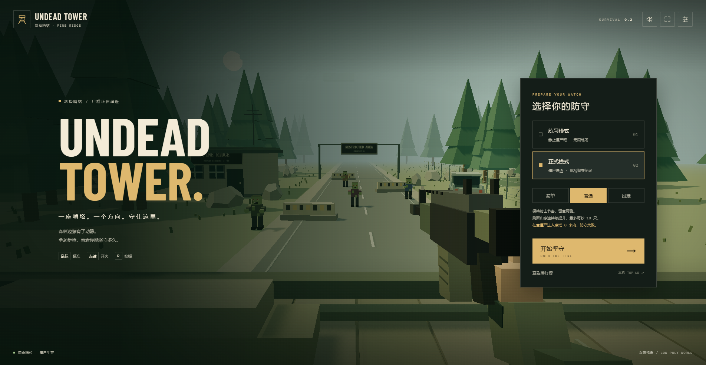

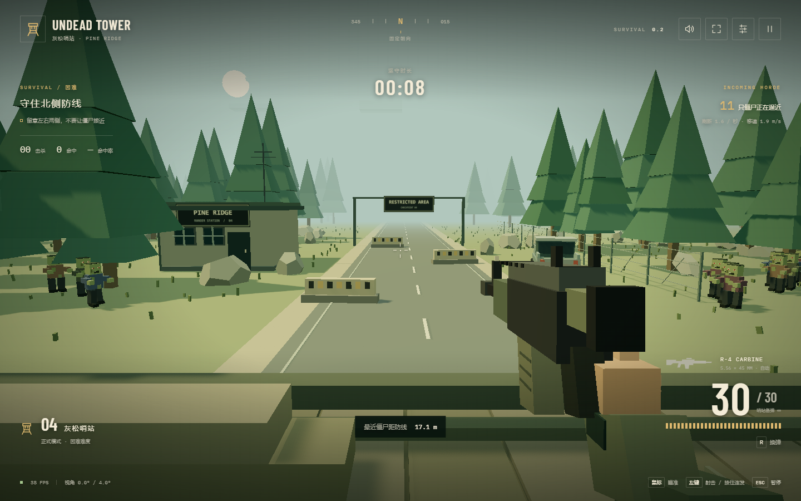

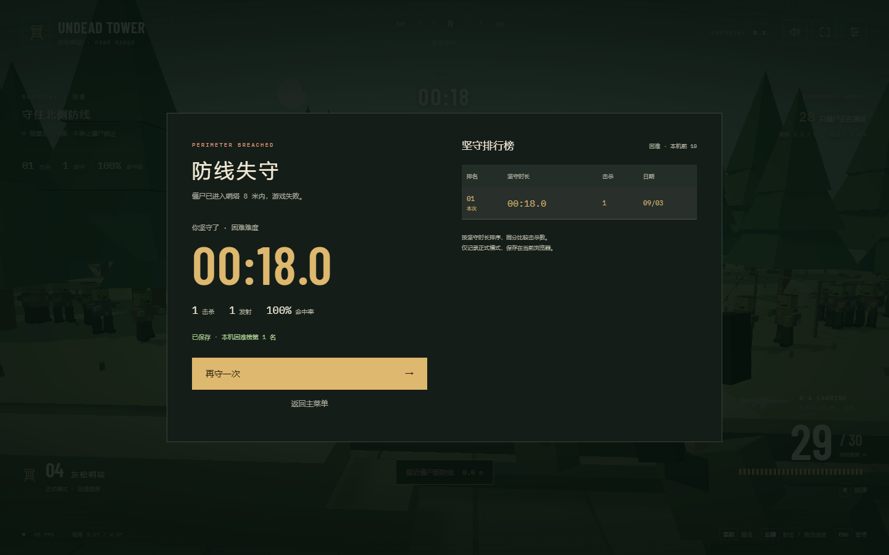

375px 模式选择截图保存在 `screenshots/modes-mobile.png`。排行榜仅在当前浏览器保存，不是联网榜；正式模式是无终点的连续生存。

---

# M0 历史验收（0.1.0）

## 手动验收步骤

1. 运行 `npm run dev`，打开 5175 端口，看到 Undead Tower 标题页和灰松哨站。
2. 进入哨站，检查右手、袖口、枪身与枪口在第一人称画面中可见。
3. 移动鼠标到画面左右和上下；准星应立即跟随，枪口转向准星，环境缓慢小幅转动。
4. 连续左右甩鼠标，停在屏幕边缘；镜头不能超过水平 ±4°、垂直 ±2.5°，不能转身看向身后。
5. 点击左键，弹药减少，枪口产生短促火光，伴随曳光、抛壳、后坐平移和枪声；按住左键可连发。
6. 射击人形靶的胸部和头部，检查命中提示与击倒；靶标应在 3 秒后重新站立。
7. 按 R 换弹，装填期间不能射击；完成后弹匣恢复 30 发。打空后不能凭空继续射击。
8. 按 Esc 暂停，点击空白处不增加射击数；按 Esc 继续。窗口失焦或切换标签页也应暂停。
9. 设置中调整镜头阻尼、静音、粗颗粒像素；设置按钮不会触发开枪。关闭设置后恢复此前的暂停/游玩状态。
10. 从暂停菜单重新开始，射击统计、命中数、靶标生命和弹药都应复位。

## 自动化覆盖

- 单元测试：屏幕坐标转换、输入越界、持续极限输入、真实镜头变化、不同帧率阻尼一致性、枪管共线、射速门控、空弹匣、换弹禁射与重置。
- 浏览器测试：实际鼠标点击/按住开火、枪口火光采样、弹药和换弹、不同屏幕位置枪口方向、靶标爆头/复位、暂停/失焦/设置、320/375/414/768px 布局、静止画面停止绘制与恢复。
- 测试失败时自动保留截图与 trace，目录为 `test-results/`，不提交这些临时结果。

## 验证记录

验收日期：2026-09-03。环境：Windows、本机 Chrome、Node.js 22.23.1。

| 项目 | 结果 |
| --- | --- |
| 单元测试 | 2 个文件，8 项通过 |
| TypeScript 与生产构建 | 通过；Three.js 单块体积产生 Vite 提示，不阻止构建 |
| 最终浏览器验收 | 9 项全部通过，单 worker 串行耗时 33.1 秒 |
| 首屏与持枪画面 | 已人工查看实际浏览器截图，右手、袖口、步枪、前方练习靶可见 |
| 小屏布局 | 320 / 375 / 414 / 768 px 的标题页截图均已查看；最窄与最宽设置页截图已查看，其余设置页自动检查通过 |
| 静止画面 | 标题、暂停时 `renderCount` 保持不变，恢复游戏后继续增加 |
| 测试期间页面异常 | 核心开火测试监听 `pageerror`，无异常 |

实际游戏截图：

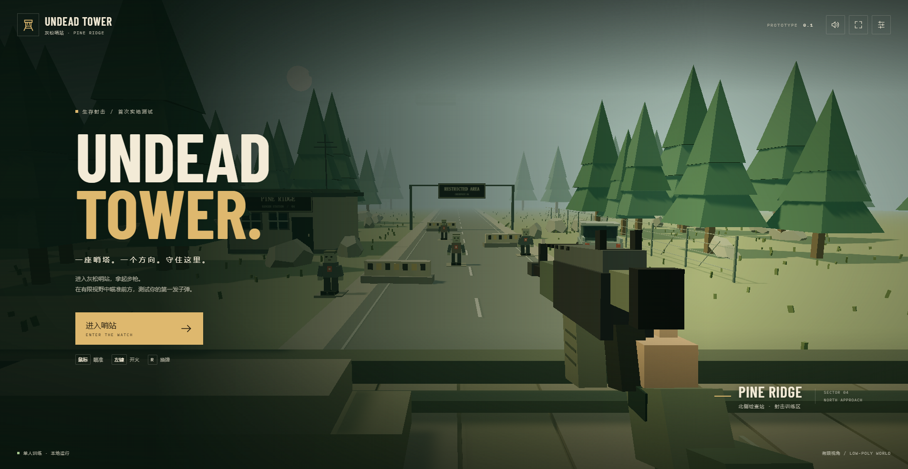

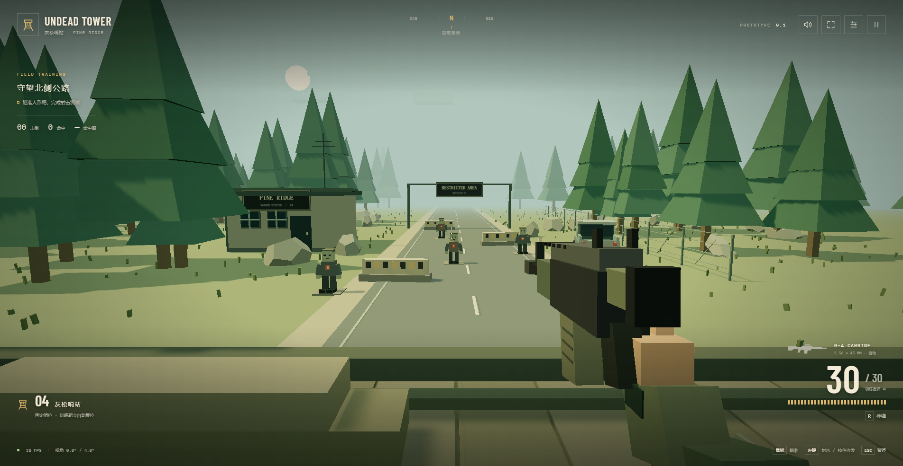

中断恢复后，将四种小屏宽度拆为独立测试，避免共享一个 30 秒时限。将静态方块合批、阴影降为 1024 并限制更新频率，同时对主菜单、暂停、后台和高分辨率显示器实施渲染预算。最后一次浏览器测试已使用最终持枪模型和资源释放逻辑。

帧率上限为 60，不是性能保证。一次 1904×985 自动化截图会话中 HUD 显示约 38 FPS；本次没有进行持续性能基准测试，也未确认此前电脑死机的系统级原因。

## 首阶段边界

本次验证射击原型，不代表敌人进攻、波次、存档和桌面安装包已经完成。声音的生成与开关有功能检查，实际音量手感还需使用者在自己的音频设备上试听。
