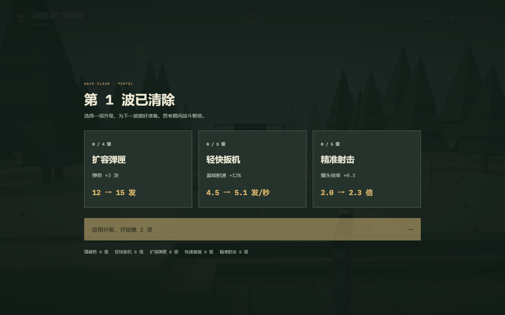
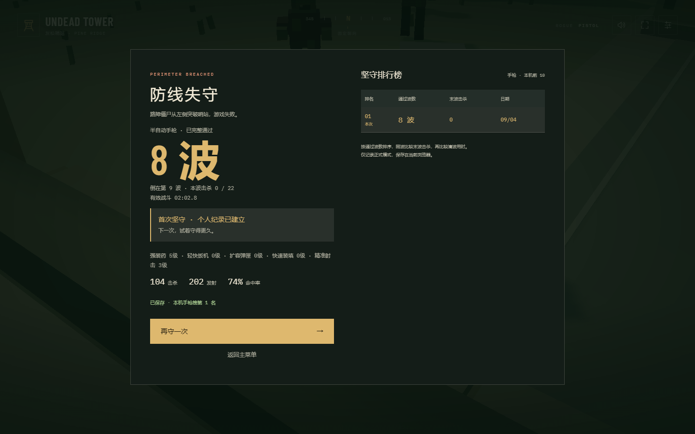
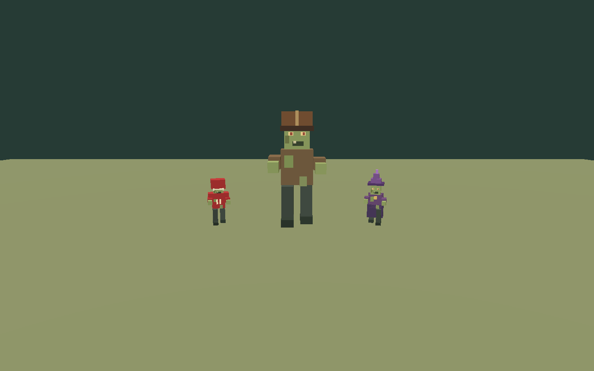
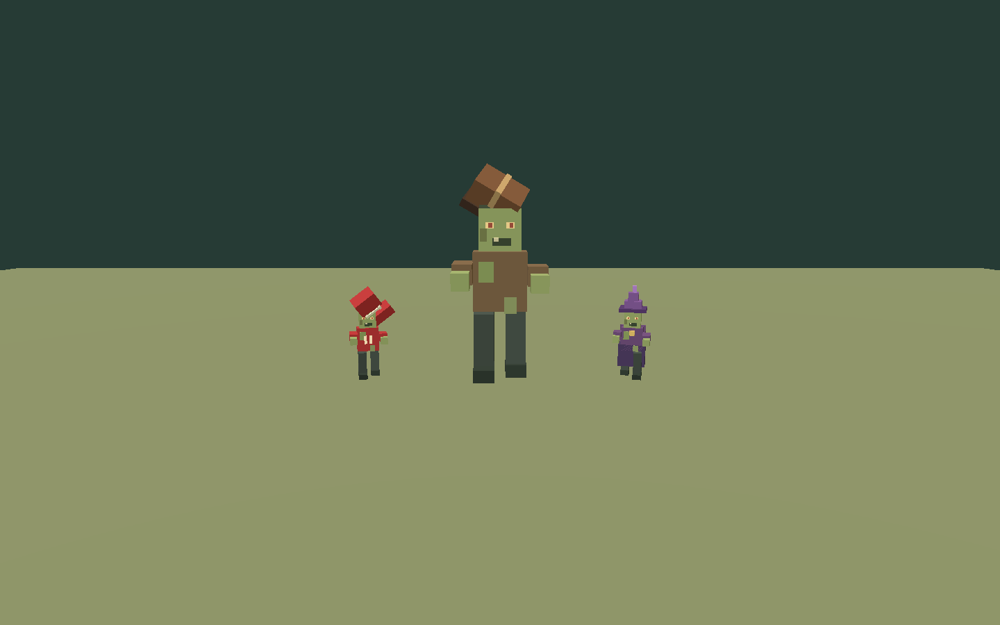

# 手枪肉鸽试玩版验收

分支：`rogue`。日期：2026-09-04。实现依据：[肉鸽设计](ROGUE-DESIGN.md)。仅更新源码及网页版。

## 已实现

- 正式模式选择半自动手枪，3 秒准备后逐波作战。练习模式仍保留六款枪械，正式模式无法通过数字键、滚轮或旧武器栏换枪。
- 固定波次名单：第 1 波 6 只，之后每波 +2；第 4/6/8 波分别引入橄榄球、巫师和巨人，第 10 波后按设计循环增加高级怪。满槽或出生位置不合法时保留待投放名额；全部生成且全歼才过波。
- 三选一升级：伤害、射速、弹容、装填速度、爆头倍率。显示升级前后数值，确认一次生效，下一波补满弹匣；达到上限的类型退出卡池。开火及换弹模型使用升级后的动作时钟。重新开局恢复基础数值。
- 橄榄球 400 生命、2.8 m/s；巨人 4,000 生命、0.7 m/s、2.5 倍体型与独立导航；巫师 2,000 生命、1.4 m/s，非致命命中后瞬移，致命命中直接死亡。
- 巫师在前方可见的合法圆周落点瞬移，保持到玩家地面位置的水平距离；落点检查障碍、其他敌人及可达性，无有效落点时原地闪烁。视觉表现采用短暂紫色方块残影和提示音，不提供无敌时间。
- 按完整通过波数排名，同波比较失败波击杀数，再比较已清波战斗用时。独立存储到 `rogue-v1`，保留旧时间榜。升级、暂停、后台、倒计时及失败动画不计入战斗时间。

## 验证结果

- **81 项单元测试通过**：包含原有回归与波次数量、失败生成重试、满槽排队、不同帧率刷新量、升级上限/公式、伤害/速度倍率、护甲掉落后物种、瞬移半径与合法性、巨人真实场景宽通道、波数排序与独立存档。
- **15 项浏览器流程通过**（单浏览器、单 worker，分组运行）：肉鸽完整对局及小屏返回练习；高级怪模型与护甲视觉夹具；音量、射击、有限镜头、暂停、响应式界面、六枪练习和动画协调回归。
- 完整对局通过鼠标/键盘输入事件清除前 8 波，经过 8 次实际选卡，再在第 9 波自然失败。保存并重新读取「通过 8 波」；重开升级等级清零，旧榜未变。自动操作只读诊断坐标，没有修改敌人生命、游戏时钟或升级结果。
- 此次自动对局共击杀 **104** 只，发射 **202** 发，有效战斗时间约 **2 分 02.8 秒**，页面未报运行错误。它优先选择伤害/爆头升级并使用精确目标坐标，不能当作普通玩家的时长或平衡结论。
- TypeScript 检查、生产构建和差异格式检查通过。Three.js 分块仍有现有体积提示，不影响构建。

实机选卡界面：

实际对局结算：

新敌人独立模型展示（与游戏使用同一模型代码，不是对局截图）：

## 边界

本轮没有局外成长、联机、中途存档或其他武器的肉鸽升级。当前五类升级属于手枪池，全部满级后可以继续挑战。后续应以真人试玩判断巫师的瞬移频率、巨人耐久和高级怪比例，不以自动化瞄准效率代替玩家体验。

`Undead Tower 0.5.0.exe` 未重新打包，SHA-256 仍为 `A78D9F5C3DA25BA2CE1B01BC2D131695EE2686E56044E3DDDEC87412EF0C36B7`。
