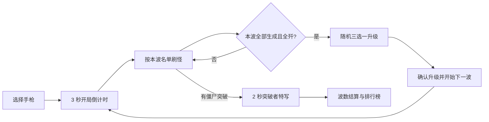

# Undead Tower · 肉鸽模式设计草案

日期：2026-09-04。分支：`rogue`，从 `main` 的 `62ed86b` 创建。

本文件保留已确认的设计方案。2026-09-04 已在 `rogue` 分支实现手枪波次、升级、波数榜与三类新僵尸，后续验证记录见 [肉鸽验收](ROGUE-ACCEPTANCE.md)。用户明确提出的规则作为设计基础；波次配置、升级幅度、出场顺序及交互细节为首轮试玩建议，可在开发前调整。现有 README 继续介绍已实现的游戏。

## 1. 本轮范围

玩家选择一把初始武器，逐波击退僵尸，每次全歼后选择一次升级，失败时按通过波数进入排行榜。升级仅在当前一局有效，重新开始全部重置。

本轮 Demo 只开放现有的**半自动手枪**，不是左轮；以后再为其他武器设计专属升级池。选择页只展示当前可用手枪，不放五张无法操作的卡片。对局中只持有选中的武器，不允许用数字键、滚轮或旧武器栏切到其他枪。

保留固定哨位、有限视角、原场景、障碍绕行、拥挤避让和两秒失败特写。任意活僵尸突破即失败。本轮不增加移动、玩家血条、局外永久加成、商店、掉落装备或联机。

建议在 `rogue` 分支中，将正式模式改为波次玩法，保留练习模式作为六枪靶场；`main` 保持当前连续生存版本。两种正式玩法的成绩分开存储。

## 2. 一局游戏的流程

- HUD 显示「第 4 波」「本波剩余 7 / 12」；剩余数包含尚未生成的敌人，不能出现画面暂时清空就误判过关。
- 本波最后一只活僵尸死亡，且没有未生成名额时，立即记为通过。允许死亡效果短暂收尾，随后出现升级卡。
- 升级期间停止刷怪、移动、战斗计时和武器操作，不限思考时间。选择卡片只预览结果，点击「应用升级，开始第 N 波」后一次性生效，防止误点或重复领取。
- 进入下一波前补满当前弹匣，清空开火按住状态及未完成换弹动作；3 秒倒计时不计入战斗用时，倒计时期间不开火。
- 暂停、失焦与后台延续当前规则，冻结战斗、倒计时和瞬移动作。选升级时失焦，回来仍停留在原选项，不能刷新卡池。
- 没有强制通关终点。第 10 波之后继续生存，失败才正式保存成绩；主动退出不给予新的排行榜成绩。

## 3. 手枪基础与升级

沿用当前半自动手枪的起始手感：身体伤害 **75**、爆头倍率 **2 倍**、射击间隔 **0.22 秒**、弹容 **12 发**、换弹 **0.85 秒**，备弹无限，每次点击一发。

首次 Demo 用五类手枪升级验证成长循环。所有选项都来自所选武器的专属池，今后其他武器可以有不同幅度和独特效果；本轮先不做弹射、穿透、自动射击等额外机制。

| 升级 | 每次效果 | 建议最高等级 | 满级效果（只计算本项） |
| --- | --- | ---: | --- |
| 强装药 | 增加基础伤害的 20% | 5 | 身体伤害 150 |
| 轻快扳机 | 射速增加基础射速的 12% | 5 | 射击间隔约 0.138 秒 |
| 扩容弹匣 | 弹容 +3 | 4 | 24 发 |
| 快速装填 | 装填速度增加基础速度的 15% | 4 | 换弹约 0.531 秒 |
| 精准射击 | 爆头倍率 +0.3 | 5 | 爆头倍率 3.5 倍 |

计算规则明确如下，避免卡片描述与实际叠加方式不一致：

- 身体伤害：`75 × (1 + 0.20 × 强装药等级)`。
- 射击间隔：`0.22 ÷ (1 + 0.12 × 轻快扳机等级)`。提高射速不等于按相同比例减少间隔。
- 弹容：`12 + 3 × 扩容弹匣等级`。
- 换弹时长：`0.85 ÷ (1 + 0.15 × 快速装填等级)`。
- 爆头伤害：`身体伤害 × (2 + 0.3 × 精准射击等级)`。伤害计算保留小数，卡片展示适度取整，不逐次取整累积误差。

每次从未满级的类型中等概率抽取 **3 个不同选项**，不出现同类重复卡。升级必须应用到每局独立属性，不能修改全局武器基础配置。

卡片同时显示效果、当前等级和升级前后数值，例如「身体伤害 75 → 90」「弹容 12 → 15」。前两级强装药让爆头伤害从 150 提升到 180、210：第二级可将路障僵尸从两枪爆头降为一枪，成长效果能直接感受到。

五类共 23 级；当剩余可升级类型少于 3 类时只展示有效类型，全部满级后只显示「配置已满，继续下一波」。不能因选项耗尽卡住，也不强行发放无效升级。长线独特词条留到后续版本。

**动画协调**：半自动属性不随射速升级改变；机械动作同步缩放到新的射击/换弹时长，实际下一枪和补弹时刻由同一个时钟控制。禁止数值已换好弹、模型还在退匣，或允许射击但套筒动作尚未结束。开局、重开、升级确认均重置动作到正确的待机状态。

## 4. 六类僵尸

普通僵尸的速度固定为 **1.4 米/秒**，不随战斗时间或波数增长。新僵尸按用户指定倍率区分速度；初版血量也不随波数额外膨胀，先用数量和阵容提升压力。

| 类型 | 总生命 | 速度 | 相对普通速度 | 定位与外观 |
| --- | ---: | ---: | ---: | --- |
| 普通 | 100 | 1.4 m/s | 1 倍 | 基础敌人，绿色僵尸 |
| 路障 | 200 | 1.4 m/s | 1 倍 | 橙色路锥，需要更多火力 |
| 铁桶 | 400 | 1.4 m/s | 1 倍 | 金属桶护甲，较耐打 |
| 橄榄球 | 400 | 2.8 m/s | 2 倍 | 橄榄球服、头盔与宽肩垫，快速突破 |
| 巨人 | 4,000 | 0.7 m/s | 0.5 倍 | 高大身形与皮革头盔，持续消耗弹药 |
| 巫师 | 2,000 | 1.4 m/s | 1 倍（建议） | 巫师袍、尖帽，每次非致命受击后瞬移 |

三种新僵尸的颜色、轮廓与动作需在当前低多边形风格中一眼可辨。橄榄球快跑、巨人大幅慢步、巫师袍摆与瞬移残影各有区分，不直接复用外部游戏的角色模型。

### 橄榄球僵尸

血量等同铁桶，但奔跑速度翻倍。首版不附加冲撞、跳跃或远程攻击，威胁来自接近速度。

建议与现有铁桶相同，100 本体 + 300 装备耐久合计 400，护具承受伤害并能脱落；护具脱落后仍是橄榄球僵尸，仍以 2.8 m/s 移动。第一次出场只投放一只并提示「快速敌人出现」。

出生点应满足可瞄准且距失败边界至少约 **8 秒直线行进时间**，即到玩家地面位置距离至少 `8 + 2.8 × 8 = 30.4 米`。这个时间不包括绕障和避让，是试玩建议的反应下限。不能从近端侧边突然冲进失败区域；没有合适入口时换有效入口，不取消本波名额。

### 巨人僵尸

总生命严格为铁桶的 10 倍，即 4,000。建议本体 3,000 + 皮革头盔耐久 1,000，沿用护甲先吸收伤害的抽象规则，总和不能额外超过 4,000。头盔打落后保留巨大体型与慢速，不变回普通僵尸。

建议身高约普通的 2.5 倍，手臂、头部命中区域和脚底位置随模型匹配。巨大体型更易命中，用血量和占路面积形成压力，第一轮不叠加减伤或免疫爆头。

巨人必须使用按实际身体宽度扩张障碍的独立导航配置；出生点只从完整路线可通行的宽阔入口中选择。现有普通僵尸的 0.95 米导航半径不能原样复用。场景若没有可供巨人通过的路径，先调整巨人的合理宽高比例或通道，不能让它穿墙、缩小碰撞体假装能通过，或生成后永远卡住。本波的巨人应尽早入场，避免全场只剩一只慢慢走来。

### 巫师僵尸

血量为铁桶的 5 倍，即 2,000；建议无额外护甲，巫师服与尖帽作为辨识外观。普通移动速度暂定 1.4 m/s。

每次有效的非致命命中，先扣除伤害，再立即选择位置瞬移；致命命中直接死亡，不再瞬移。初版不加长冷却或随机触发率，保留「打中就瞬移」的辨识度，也不提供瞬移无敌时间或回血。

瞬移规则需要适应固定视角：

1. 保持瞬移前到玩家**地面位置的水平直线距离**完全相同，在该圆周上选择随机点；不按到高处摄像头的三维距离计算。
2. 只允许前方可瞄准、当前镜头中头部与身体可见的有效点，不能到身后、屏幕外或完全被建筑遮挡的位置。这是对「任意位置」的必要可玩性约束。
3. 落点不能落在障碍或其他僵尸体内，且必须存在到哨塔的可行走路线。不能先生成无效点，再投影到别处导致半径改变。
4. 优先保证有明显横向位移，建议至少约 8°方位变化；最多尝试 24 个候选点。没有合法点就留在原地播放闪烁，伤害正常结算，不能取消命中、消失或拖住过波。
5. 起点和终点有约 0.2 秒紫色残影及轻提示音；终点本体从瞬移完成起即可被打中。已死亡目标不参与后续瞬移或碰撞。
6. 暂停时视觉效果及任何待处理事件均冻结。同一发攻击只触发一次瞬移，预留未来散弹、多段伤害的归并规则。

相同直线距离不代表剩余绕障路程相同，瞬移可能让接近路线更短。因此不宣传为「完全不改变威胁」，首轮需观察近距离瞬移是否仍留有合理反应时间。

## 5. 波次阵容与投放

每波开始前确定完整名单。波内总数量固定、类型数量固定，只随机打乱出场顺序及合规入口；不会因为玩家清得快而偷偷补怪。

建议总数 `N(w) = 6 + 2 × (w - 1)`，首轮前 10 波如下。表中每行相加必须等于本波总数。

| 波数 | 普通 | 路障 | 铁桶 | 橄榄球 | 巨人 | 巫师 | 总数 |
| --- | ---: | ---: | ---: | ---: | ---: | ---: | ---: |
| 1 | 6 | 0 | 0 | 0 | 0 | 0 | 6 |
| 2 | 6 | 2 | 0 | 0 | 0 | 0 | 8 |
| 3 | 7 | 2 | 1 | 0 | 0 | 0 | 10 |
| 4 | 8 | 2 | 1 | 1 | 0 | 0 | 12 |
| 5 | 8 | 3 | 2 | 1 | 0 | 0 | 14 |
| 6 | 9 | 3 | 2 | 1 | 0 | 1 | 16 |
| 7 | 9 | 4 | 3 | 1 | 0 | 1 | 18 |
| 8 | 9 | 4 | 3 | 2 | 1 | 1 | 20 |
| 9 | 10 | 4 | 4 | 2 | 1 | 1 | 22 |
| 10 | 10 | 5 | 4 | 2 | 1 | 2 | 24 |

第 11 波起继续每波 +2 只。建议先在第 10 波名单上保留已有数量，将新增的两个名额按以下 5 波循环追加：

- 第 11、16、21……波：路障 +1、铁桶 +1。
- 第 12、17、22……波：铁桶 +1、橄榄球 +1。
- 第 13、18、23……波：路障 +1、巫师 +1。
- 第 14、19、24……波：铁桶 +1、橄榄球 +1。
- 第 15、20、25……波：普通 +1、巨人 +1。

这让总数与高级敌人数量持续增加，每 5 波只增加 1 只巨人，避免高血量单位过早挤满阵容。该方案为可复现的初始配置，不宣称已经平衡。

建议刷新速率为 `min(10, 0.8 + 0.15 × (w - 1))` 只/秒，波内恒定，不再随战斗秒数增长。第 1 波约 0.8 只/秒、第 10 波 2.15 只/秒、第 63 波起封顶 10 只/秒。每波倒计时结束即生成首只，之后按速率释放剩余名额。新敌人首次出场及巨人安排在本波第一批，避免被随机到最后。

所有敌人仍需来自有效、可瞄准的入口，继续避免连续挤在同一侧；初版不同时成批投放多个橄榄球僵尸。并发实体仍受 256 个槽位限制，但这是场上上限，**不是一波的总数上限**。满槽时延迟投放，禁止丢弃名额；无有效出生点时保留待生成状态并寻找其他入口。不能因为尸体尚未回收就错误跳过敌人或结算。

## 6. 难度与时长判断

初始手枪全爆头分别需要：普通 1 枪、路障 2 枪、铁桶 3 枪、橄榄球 3 枪、巨人 27 枪、巫师 14 枪。这只是未升级且不漏枪的伤害下界，未计入换弹、重新瞄准、瞬移及遮挡。

巨人和巫师不适合第一波就大量出现。按草案，橄榄球在第 4 波、巫师在第 6 波、巨人在第 8 波首次出现，玩家届时分别已选过 3、5、7 次升级。主要考验依次是优先级、重新捕捉目标、持续火力。

此前提出的单局 1～3 分钟仍作为时长参考，但目前没有数据证明这套升级波次能达到它。增加波间选择后，墙钟时间会包含阅读和思考，不能与原连续生存的战斗用时直接比较。建议首轮分别统计有效战斗时长、选卡时长和到达波数，再决定是否需要更快的投放或更早引入高级怪；不为追求时长恢复普通僵尸的无限移速增长。

优先观察：一般玩家是否能在前几波体验升级；同一波数是否出现有趣的不同选项；巨人是否变成纯粹消耗时间的血袋；巫师是否因每次瞬移使半自动点击过度疲劳；橄榄球是否存在出生即几乎必输的入口。

## 7. 排行榜定义

主成绩为**完整通过波数**，不是进入过的最高波数。死在第 6 波时，显示「通过 5 波 · 倒在第 6 波」。第一波失败可以保存为通过 0 波。

建议排序优先级：通过波数降序 → 失败波内击杀数降序 → 完整通过各波的累计战斗用时升序 → 成绩时间与唯一 ID 稳定排序。这样主指标始终是波数，同波奖励多清怪及更高的通关效率；不会奖励留一只怪拖时间。升级、倒计时、暂停、后台及失败动画都不进入通关用时，失败波的拖延时间也不参与效率排序。

结算显示通过波数、失败波、本波击杀/总数、总击杀、有效战斗时长、使用武器及升级摘要。建立、刷新和追平个人纪录的主要提示改为比较通过波数，同波的细分名次另行展示。

独立本机存储键建议为 `undead-tower.leaderboard.rogue-v1`，不覆盖当前 `armor-v3` 时间榜。保存规则版本、武器 ID、通过波数、失败波内击杀、清波用时、总用时、升级列表等；拒绝缺失关键字段或数值非法的记录。未来多武器上线默认按武器分榜，避免未经平衡的武器共享名次。

## 8. 接入现有项目的方式

| 现有部分 | 计划改动 |
| --- | --- |
| Encounter / 刷怪 | 从无限刷怪切换为完整波次名单、待生成队列、存活计数和过波事件；按种类计算移速 |
| Game / 菜单 | 增加武器选择、倒计时、升级选择阶段；重用射击、暂停、失败特写和设置 |
| Arsenal / Firearm | 一局只装备选定手枪；维护每局属性快照，升级后同步属性与动画时钟 |
| 僵尸类型与护甲 | 分离物种、剩余本体生命和装备状态；禁止护甲掉落就把所有新物种变为普通僵尸 |
| ZombieField | 扩展三类模型、不同体型命中区、跑步/慢步/瞬移表现；继续批量绘制和复用特效 |
| Navigation | 按普通体型和巨人体型缓存导航；验证巨人出生及全程可达，瞬移检查独立落点 |
| Leaderboard / 结算 | 新增波数成绩结构、排序与个人纪录反馈，保留旧模式存档 |

波次、入口和升级使用独立的带种子随机序列，暂停、截图或特效随机变化不能改变敌人名单和选卡结果。种子与规则版本随诊断信息记录，方便复现异常局；不把调试接口加入生产版。

## 9. 建议实施顺序与验收

1. **手枪波次闭环**：选择手枪、3 秒倒计时、固定波次总量、全歼过波；先用普通/路障/铁桶。验证生成间隙不误判、满槽不丢名额、同帧最后一击与突破按既定战斗顺序只产生一个结果。
2. **三选一成长**：五类升级、效果预览、限级、弹匣补满和动作同步。验证重复点击不能重复升级、卡池耗尽可继续、重开属性还原、正式模式不能切出手枪。
3. **波数成绩**：失败流程与新榜。验证死在第 N 波记 N-1 波、暂停/拖延不抬高排名、旧榜不污染、存储不可用时仍可结束游戏。
4. **三类高级僵尸**：橄榄球先接入，再巨人导航与模型，最后巫师瞬移。验证实际血量/速度倍率、装备掉落后种类不变、巨人不穿模、不刷不可达敌人、瞬移保持半径且可见可达、致命命中不瞬移。
5. **完整试玩**：检查不同升级选择对压力的影响，至少覆盖三类新僵尸各一次、正常失败与重开。实际试玩与自动化验证分开记录，不把自动精准瞄准当作一般玩家的时长依据。

技术验收继续使用单浏览器、单 worker；必要逻辑测试覆盖波次计数、升级公式、排序和落点约束。本轮已按上述顺序实现并验证，未修改成品包。
